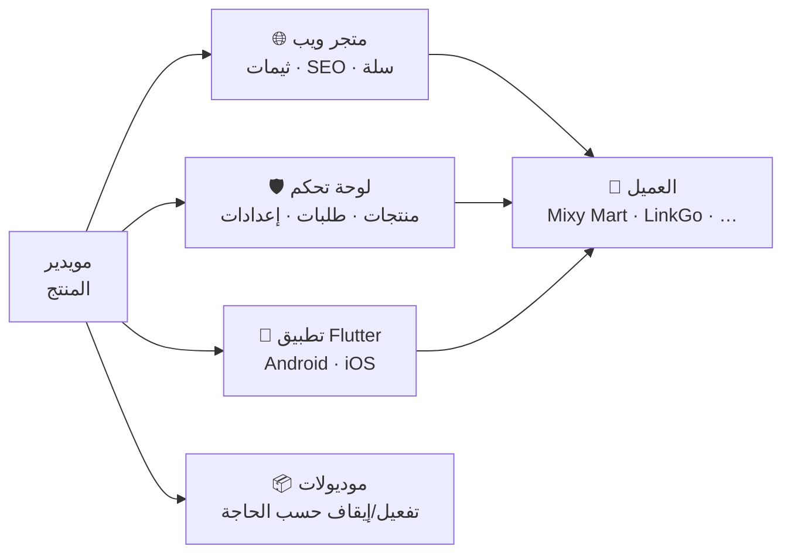
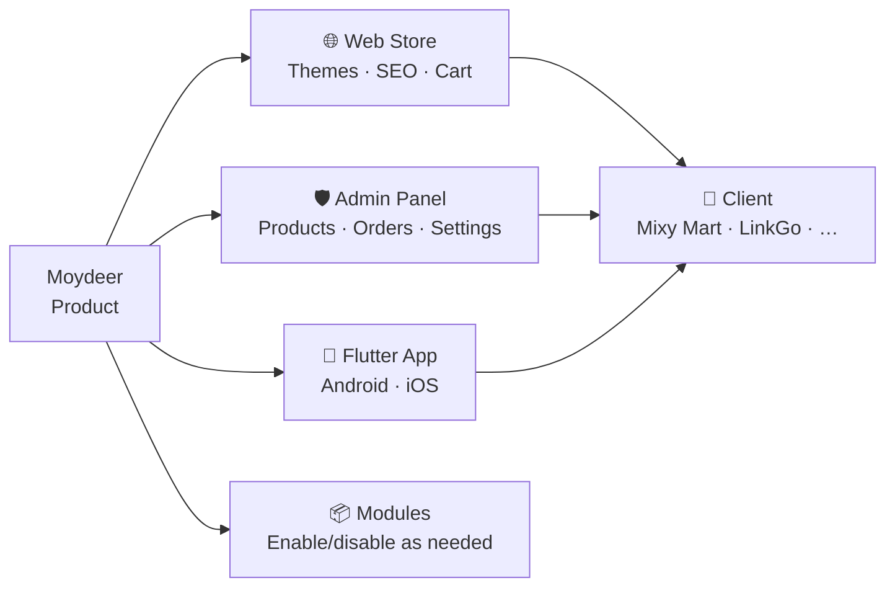

<div align="center">

# مويدير · Moydeer

### متجر إلكتروني متكامل — ويب · أدمن · تطبيق · موديولات  
### Full Online Store — Web · Admin · Mobile App · Modules

<br>

[](https://mixy-mart.com)
[](https://mixy-mart.com/admin)
[](https://mixy-mart.com/api/v1/products)
[](https://mudiridigi.com)

<br>

[](https://laravel.com)
[](https://flutter.dev)
[](https://livewire.laravel.com)
[](https://php.net)

<br><br>

### 🌐 Language · اللغة

**[🇪🇬 العربية](#ar)** &nbsp;·&nbsp; **[🇬🇧 English](#en)**

</div>

---

<a id="links"></a>

## 🔗 روابط · Links

<table align="center">
<tr>
<td align="center" width="25%">
<strong>🛒 عميل — Mixy Mart</strong><br>
<a href="https://mixy-mart.com"><code>mixy-mart.com</code></a>
</td>
<td align="center" width="25%">
<strong>🛡️ لوحة التحكم</strong><br>
<a href="https://mixy-mart.com/admin"><code>/admin</code></a>
</td>
<td align="center" width="25%">
<strong>📡 REST API</strong><br>
<a href="https://mixy-mart.com/api/v1/products"><code>/api/v1</code></a>
</td>
<td align="center" width="25%">
<strong>🗺️ Sitemap</strong><br>
<a href="https://mixy-mart.com/sitemap.xml"><code>/sitemap.xml</code></a>
</td>
</tr>
<tr>
<td align="center" width="25%">
<strong>🛍️ Google Merchant</strong><br>
<a href="https://mixy-mart.com/feeds/google-merchant.xml"><code>/feeds/google-merchant.xml</code></a>
</td>
<td align="center" width="25%">
<strong>🌐 موديري ديجي</strong><br>
<a href="https://mudiridigi.com"><code>mudiridigi.com</code></a>
</td>
<td align="center" width="25%">
<strong>🛒 المتجر الرقمي</strong><br>
<a href="https://mudiridigi.shop"><code>mudiridigi.shop</code></a>
</td>
<td align="center" width="25%">
<strong>📧 التواصل</strong><br>
<a href="mailto:dev.nour.m@gmail.com"><code>dev.nour.m@gmail.com</code></a>
</td>
</tr>
</table>

> **مويدير** منتج تبيعه [موديري ديجي](https://mudiridigi.com) للعملاء — كل عميل يحصل على متجره بهويته ودومينه.  
> **Mixy Mart** و**LinkGo** من عملاء منشّرين — ليسوا اسم المنتج.

---

<a id="ar"></a>

## 🇪🇬 العربية

### نظرة عامة

**مويدير (Moydeer)** منتج متجر إلكتروني كامل تبيعه **موديري ديجي** للتجار والشركات: واجهة متجر · لوحة تحكم · تطبيق موبايل · عشرات الموديولات القابلة للتفعيل · 9+ ثيمات جاهزة — جاهز للإطلاق على **Hostinger** أو **VPS**.

<table>
<tr><td>🎯 <strong>المنتج</strong></td><td>مويدير — Online Store Platform</td></tr>
<tr><td>🏢 <strong>المطوّر</strong></td><td><a href="https://mudiridigi.com">موديري ديجي · Mudiri Digi</a></td></tr>
<tr><td>🛒 <strong>عميل منشور</strong></td><td><a href="https://mixy-mart.com">Mixy Mart · mixy-mart.com</a></td></tr>
<tr><td>🌍 <strong>السوق</strong></td><td>مصر · EGP · عربي + إنجليزي (RTL/LTR)</td></tr>
<tr><td>📦 <strong>المكوّنات</strong></td><td>Web · Admin · Flutter App · 40+ Module flags</td></tr>
<tr><td>✅ <strong>الحالة</strong></td><td>Production · يُسلّم للعملاء جاهزاً</td></tr>
</table>

---

### التحدي

التاجر أو الشركة يحتاج متجراً احترافياً بدون:
- بناء من الصفر كل مرة
- فوضى ملفات وإضافات متضاربة
- واجهة عربية ضعيفة أو بدون تطبيق
- غياب SEO · Pixels · Google Merchant · دفع محلي

**الحل:** منتج واحد — **مويدير** — يُخصّص لكل عميل (اسم · دومين · ألوان · شعار · تطبيق) ويُسلّم جاهزاً.

---

### ماذا يحصل العميل؟



| السطح | المسار | ماذا يفعل |
|:--|:--|:--|
| **Storefront** | `/` | متجر عام · كتالوج · سلة · checkout |
| **Admin** | `/admin` | إدارة كاملة — منتجات · طلبات · موبايل · SEO |
| **Mobile App** | Flutter | نفس الكتالوج · auth · checkout · FCM |
| **API** | `/api/v1` | REST · Sanctum · bootstrap للتطبيق |

---

### عملاء منشّرون (أمثلة)

| العميل | الدومين | ملاحظة |
|:--|:--|:--|
| **Mixy Mart** | [mixy-mart.com](https://mixy-mart.com) | متجر إنتاج حي |
| **LinkGo** | — | عميل سابق — الاسم legacy في الكود فقط |

> كل عميل: `APP_NAME` · دومين · شعار · ألوان · bundle التطبيق — منفصل عن **مويدير** كمنتج.

---

### الموديولات — تفعيل حسب الحاجة

```env
MODULE_STORE · MODULE_ORDERS · MODULE_PAYMENTS · MODULE_EASYKASH
MODULE_SHIPPING · MODULE_COUPONS · MODULE_BUNDLES · MODULE_REVIEWS
MODULE_BLOG · MODULE_SEO · MODULE_PIXELS · MODULE_GOOGLE_MERCHANT
MODULE_CHATBOT · MODULE_API · MODULE_MOBILE · MODULE_WISHLIST
MODULE_INVENTORY · MODULE_PROFIT · MODULE_COUNTRIES · MODULE_CURRENCIES
MODULE_AUTH_GOOGLE · MODULE_AUTH_FACEBOOK · MODULE_PERMISSIONS · …
```

عند تعطيل موديول → مساراته وقوائمه تختفي **بدون أخطاء**.

<details open>
<summary><strong>🛒 متجر وكتالوج</strong></summary>

- منتجات · فئات · brands · materials · attribute templates
- سلة · wishlist · upsell · downsell · bundles
- تقييمات · quick add · import
- مخزون · cost · profit tracking
- دول · عملات · multi-country (اختياري)

</details>

<details open>
<summary><strong>💳 طلبات ودفع</strong></summary>

- 11 حالة طلب · OrderStatusLog
- EasyKash (HMAC webhook) · الدفع عند الاستلام (COD)
- شحن بالمحافظات (flat rate)
- كوبونات · abandoned checkout
- انتهاء الطلبات غير المدفوعة (TTL)

</details>

<details open>
<summary><strong>📱 تطبيق الموبايل</strong></summary>

- Flutter — Android · iOS
- Bootstrap من `/api/v1/app/bootstrap`
- Google · Facebook Login · Sanctum
- Remote config من `/admin/mobile` (شعار · splash · intro · popups)
- FCM push · deep link `mudiridigi://pay`
- بناء APK/AAB لكل عميل بـ bundle ID خاص

</details>

<details open>
<summary><strong>📈 نمو وSEO</strong></summary>

- SEO · sitemap · Schema
- Pixels: Meta · TikTok · Snap · GA · GTM · GSC
- Google Merchant XML feed
- Chatbot (+ AI اختياري)
- Social links · blog · analytics

</details>

---

### 9+ Theme Packs

ثيمات جاهزة حسب نوع المتجر — structure + CSS + surfaces:

| Theme | النيتش |
|:--|:--|
| **Nile** | كلاسيك |
| **Bazaar** | ماركت |
| **Pulse** | نبض — image-forward |
| **Aura** | أورا — polish + drawer |
| **Loom** | نسيج — fashion |
| **Gleam** | لمعان — jewelry |
| **Bloom** | إشراق — beauty |
| **Pantry** | مؤونة — grocery |
| **Forge** | مصهر — electronics |

> ألوان من ThemeStore · نصوص من `__('store.*')` — i18n audit إلزامي

---

### دورة الطلب

```
زائر → سلة → Checkout → EasyKash / COD
     → OrderStatus (11) → شحن محافظة → تسليم
     → OrderStatusLog (system · admin · customer)
```

---

### مقاييس المشروع

| المقياس | القيمة |
|:--|--:|
| Laravel Modules (packages) | 15 |
| Module flags (`.env`) | 40+ |
| Theme Packs | 9+ |
| Order statuses | 11 |
| Locales | ar · en |
| Payment | EasyKash · COD |
| Deploy targets | Hostinger · VPS |

---

### Technology Stack

| Backend | Mobile | Ops |
|:--|:--|:--|
| Laravel 12 · PHP 8.3 | Flutter · Sanctum | Hostinger `public_html/` |
| Livewire 4 | Google · Facebook Auth | VPS · Nginx · Supervisor |
| nwidart/laravel-modules | FCM · App Links | Queue · Cron |
| Spatie Permissions | Remote config | `i18n:audit` CI |
| EasyKash HMAC · Vite | APK/AAB per client | Cloudflare |

---

<div align="center">

**[⬆️ العودة للأعلى](#links)** &nbsp;·&nbsp; **[🇬🇧 English](#en)**

</div>

---

<a id="en"></a>

## 🇬🇧 English

### Overview

**Moydeer (مويدير)** is a complete online store product sold by **Mudiri Digi** to merchants and businesses: storefront · admin panel · mobile app · dozens of toggleable modules · 9+ ready themes — deployable on **Hostinger** or **VPS**.

<table>
<tr><td>🎯 <strong>Product</strong></td><td>Moydeer — Online Store Platform</td></tr>
<tr><td>🏢 <strong>Developer</strong></td><td><a href="https://mudiridigi.com">Mudiri Digi · موديري ديجي</a></td></tr>
<tr><td>🛒 <strong>Live client</strong></td><td><a href="https://mixy-mart.com">Mixy Mart · mixy-mart.com</a></td></tr>
<tr><td>🌍 <strong>Market</strong></td><td>Egypt · EGP · Arabic + English (RTL/LTR)</td></tr>
<tr><td>📦 <strong>Surfaces</strong></td><td>Web · Admin · Flutter App · 40+ module flags</td></tr>
<tr><td>✅ <strong>Status</strong></td><td>Production · delivered ready to clients</td></tr>
</table>

---

### The Challenge

A merchant or company needs a professional store without:
- Building from scratch every time
- Plugin chaos and conflicting add-ons
- Weak Arabic UX or no mobile app
- Missing SEO · Pixels · Google Merchant · local payments

**Solution:** One product — **Moydeer** — customized per client (name · domain · colors · logo · app) and delivered ready to launch.

---

### What the Client Gets



| Surface | Path | Purpose |
|:--|:--|:--|
| **Storefront** | `/` | Public store · catalog · cart · checkout |
| **Admin** | `/admin` | Full management — products · orders · mobile · SEO |
| **Mobile App** | Flutter | Same catalog · auth · checkout · FCM |
| **API** | `/api/v1` | REST · Sanctum · app bootstrap |

---

### Published Clients (Examples)

| Client | Domain | Note |
|:--|:--|:--|
| **Mixy Mart** | [mixy-mart.com](https://mixy-mart.com) | Live production store |
| **LinkGo** | — | Former client — legacy name in code only |

> Each client gets: `APP_NAME` · domain · branding · app bundle — separate from **Moydeer** as the product.

---

### Modules — Enable as Needed

```env
MODULE_STORE · MODULE_ORDERS · MODULE_PAYMENTS · MODULE_EASYKASH
MODULE_SHIPPING · MODULE_COUPONS · MODULE_BUNDLES · MODULE_REVIEWS
MODULE_BLOG · MODULE_SEO · MODULE_PIXELS · MODULE_GOOGLE_MERCHANT
MODULE_CHATBOT · MODULE_API · MODULE_MOBILE · MODULE_WISHLIST
MODULE_INVENTORY · MODULE_PROFIT · MODULE_COUNTRIES · MODULE_CURRENCIES
MODULE_AUTH_GOOGLE · MODULE_AUTH_FACEBOOK · MODULE_PERMISSIONS · …
```

When a module is disabled → its routes and menus disappear **without errors**.

<details open>
<summary><strong>🛒 Store & Catalog</strong></summary>

- Products · categories · brands · materials · attribute templates
- Cart · wishlist · upsell · downsell · bundles
- Reviews · quick add · import
- Inventory · cost · profit tracking
- Countries · currencies · multi-country (optional)

</details>

<details open>
<summary><strong>💳 Orders & Payments</strong></summary>

- 11 order statuses · OrderStatusLog
- EasyKash (HMAC webhook) · Cash on Delivery (COD)
- Governorate-based shipping (flat rate)
- Coupons · abandoned checkout
- Unpaid order expiry (TTL)

</details>

<details open>
<summary><strong>📱 Mobile App</strong></summary>

- Flutter — Android · iOS
- Bootstrap from `/api/v1/app/bootstrap`
- Google · Facebook Login · Sanctum
- Remote config from `/admin/mobile` (logo · splash · intro · popups)
- FCM push · deep link `mudiridigi://pay`
- APK/AAB build per client with custom bundle ID

</details>

<details open>
<summary><strong>📈 Growth & SEO</strong></summary>

- SEO · sitemap · Schema
- Pixels: Meta · TikTok · Snap · GA · GTM · GSC
- Google Merchant XML feed
- Chatbot (+ optional AI)
- Social links · blog · analytics

</details>

---

### 9+ Theme Packs

Ready-made niche themes — structure + CSS + surfaces:

| Theme | Niche |
|:--|:--|
| **Nile** | Classic |
| **Bazaar** | Marketplace |
| **Pulse** | Image-forward |
| **Aura** | Polish + drawer |
| **Loom** | Fashion |
| **Gleam** | Jewelry |
| **Bloom** | Beauty |
| **Pantry** | Grocery |
| **Forge** | Electronics |

> Colors from ThemeStore · copy from `__('store.*')` — mandatory i18n audit

---

### Order Lifecycle

```
Visitor → Cart → Checkout → EasyKash / COD
        → OrderStatus (11) → governorate shipping → Delivered
        → OrderStatusLog (system · admin · customer)
```

---

### Project Metrics

| Metric | Value |
|:--|--:|
| Laravel Modules (packages) | 15 |
| Module flags (`.env`) | 40+ |
| Theme Packs | 9+ |
| Order statuses | 11 |
| Locales | ar · en |
| Payment | EasyKash · COD |
| Deploy targets | Hostinger · VPS |

---

### Technology Stack

| Backend | Mobile | Ops |
|:--|:--|:--|
| Laravel 12 · PHP 8.3 | Flutter · Sanctum | Hostinger `public_html/` |
| Livewire 4 | Google · Facebook Auth | VPS · Nginx · Supervisor |
| nwidart/laravel-modules | FCM · App Links | Queue · Cron |
| Spatie Permissions | Remote config | `i18n:audit` CI |
| EasyKash HMAC · Vite | APK/AAB per client | Cloudflare |

---

<div align="center">

**[⬆️ Back to top](#links)** &nbsp;·&nbsp; **[🇪🇬 العربية](#ar)**

</div>

---

<div align="center">

## 🏢 Developed by · تطوير

<br>

### [موديري ديجي · Mudiri Digi](https://mudiridigi.com)

*نظام واضح لمتجرك أو عيادتك أو موقع شركتك — بدون فوضى ملفات*  
*Clear systems for your store, clinic, or company website*

<br>

<table>
<tr>
<td align="center">
<strong>🌐 الموقع · Website</strong><br>
<a href="https://mudiridigi.com">mudiridigi.com</a>
</td>
<td align="center">
<strong>🛒 المتجر الرقمي</strong><br>
<a href="https://mudiridigi.shop">mudiridigi.shop</a>
</td>
<td align="center">
<strong>📧 البريد · Email</strong><br>
<a href="mailto:dev.nour.m@gmail.com">dev.nour.m@gmail.com</a>
</td>
<td align="center">
<strong>📞 الهاتف · Phone</strong><br>
<a href="tel:+201552114232">+20 155 211 4232</a>
</td>
</tr>
<tr>
<td align="center" colspan="2">
<strong>💬 واتساب · WhatsApp</strong><br>
<a href="https://wa.me/201552114232">wa.me/201552114232</a>
</td>
<td align="center" colspan="2">
<strong>🛒 عميل — Mixy Mart</strong><br>
<a href="https://mixy-mart.com">mixy-mart.com</a>
</td>
</tr>
</table>

<br>

[](https://mudiridigi.com)
[](https://mudiridigi.shop)
[](https://mixy-mart.com)
[](mailto:dev.nour.m@gmail.com)
[](https://wa.me/201552114232)

<br><br>

---

**مويدير · Moydeer** — Online Store Product · Web · Admin · Mobile · Modules

*© Mudiri Digi · All rights reserved*

</div>
