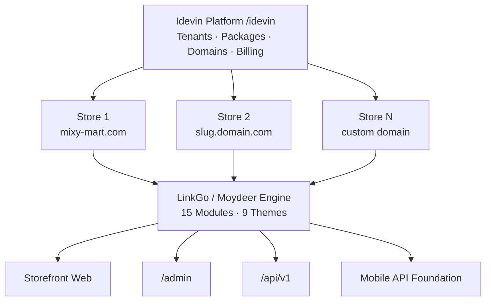

<div align="center">

# مويدير · LinkGo — Idevin SaaS

### منصة متاجر إلكترونية معيارية + لوحة SaaS متعددة المستأجرين  
### Modular E-Commerce Engine + Multi-Tenant SaaS Platform

<br>

[](https://mixy-mart.com)
[](https://mixy-mart.com/idevin)
[](https://mixy-mart.com/admin)
[](https://mixy-mart.com/api/v1/products)

<br>

[](https://laravel.com)
[](https://livewire.laravel.com)
[](https://php.net)
[](https://mixy-mart.com)

<br><br>

### 🌐 Language · اللغة

**[🇪🇬 العربية](#ar)** &nbsp;·&nbsp; **[🇬🇧 English](#en)**

</div>

---

<a id="links"></a>

## 🔗 روابط المشروع · Project Links

<table align="center">
<tr>
<td align="center" width="25%">
<strong>🛒 متجر إنتاج</strong><br>
<a href="https://mixy-mart.com"><code>mixy-mart.com</code></a>
</td>
<td align="center" width="25%">
<strong>🛡️ لوحة المتجر</strong><br>
<a href="https://mixy-mart.com/admin"><code>/admin</code></a>
</td>
<td align="center" width="25%">
<strong>⚙️ Idevin Platform</strong><br>
<a href="https://mixy-mart.com/idevin"><code>/idevin</code></a>
</td>
<td align="center" width="25%">
<strong>📡 REST API</strong><br>
<a href="https://mixy-mart.com/api/v1/products"><code>/api/v1</code></a>
</td>
</tr>
<tr>
<td align="center" width="25%">
<strong>🗺️ Sitemap</strong><br>
<a href="https://mixy-mart.com/sitemap.xml"><code>/sitemap.xml</code></a>
</td>
<td align="center" width="25%">
<strong>🛍️ Google Merchant</strong><br>
<a href="https://mixy-mart.com/feeds/google-merchant.xml"><code>/feeds/google-merchant.xml</code></a>
</td>
<td align="center" width="25%">
<strong>🌐 موديري ديجي</strong><br>
<a href="https://mudiridigi.com"><code>mudiridigi.com</code></a>
</td>
<td align="center" width="25%">
<strong>🛒 المتجر الرقمي</strong><br>
<a href="https://mudiridigi.shop"><code>mudiridigi.shop</code></a>
</td>
</tr>
</table>

---

<a id="ar"></a>

## 🇪🇬 العربية

### نظرة عامة

**مويدير (Moydeer) / LinkGo** محرك متجر إلكتروني Laravel 12 معياري لمصر (EGP · عربي + إنجليزي)، مبني للعمل على **Hostinger Shared Hosting** و**VPS**. فوقه **Idevin Platform** — لوحة SaaS على `/idevin` لإنشاء وإدارة **متاجر متعددة** بقاعدة بيانات منفصلة لكل متجر.

<table>
<tr><td>🎯 <strong>النوع</strong></td><td>White-label E-Commerce + Multi-Tenant SaaS</td></tr>
<tr><td>🛒 <strong>مثال إنتاج</strong></td><td><a href="https://mixy-mart.com">mixy-mart.com</a></td></tr>
<tr><td>⚙️ <strong>المنصة</strong></td><td>Idevin · <code>/idevin</code></td></tr>
<tr><td>🌍 <strong>السوق</strong></td><td>مصر · EGP · AR + EN (RTL/LTR)</td></tr>
<tr><td>📦 <strong>Modules</strong></td><td>15 وحدة · 9+ Theme Packs</td></tr>
<tr><td>✅ <strong>الحالة</strong></td><td>Production · Platform Waves مكتملة</td></tr>
</table>

---

### التحدي

التجار والوكالات يحتاجون:
- متجر إلكتروني جاهز للإطلاق بسرعة — بدون بناء من الصفر
- دعم عربي/إنجليزي حقيقي (RTL · i18n audit)
- دفع محلي (EasyKash · COD) + شحن بالمحافظات
- SEO · Pixels · Google Merchant من اليوم الأول
- منصة SaaS لإدارة عشرات المتاجر — DB معزولة · دومينات · باقات · إضافات

**الهدف:** محرك متجر واحد + لوحة منصة — نفس الكود، متاجر مستقلة.

---

### الحل — طبقتان



| الطبقة | المسار | الدور |
|:--|:--|:--|
| **Idevin** | `/idevin` | لوحة المنصة — متاجر · باقات · دومينات · Cloudflare · RBAC |
| **Store Engine** | `Modules/Store` + … | محرك المتجر — كتالوج · سلة · checkout · أدمن |
| **Tenant Runtime** | `IdentifyTenant` | DB منفصلة لكل متجر · entitlements · ModuleGate |
| **API** | `/api/v1` | منتجات · auth · checkout · mobile bootstrap |

---

### Idevin Platform

| الميزة | التفاصيل |
|:--|:--|
| **Multi-Tenant** | كود واحد · DB منفصلة (SQLite محلي / MySQL إنتاج) |
| **Domains** | `{slug}.root` · `slug.localhost` · دومين مخصص + تحقق DNS |
| **Cloudflare** | إدارة DNS من اللوحة · Zone ID · API Token |
| **Packages** | باقات · entitlements · ModuleGate |
| **Addon Marketplace** | `/admin/marketplace` — تفعيل مجاني / شراء مدفوع |
| **Billing** | EasyKash (أساسي) · Paymob (اختياري) |
| **Central API** | `/api/platform/v1/*` للمتاجر البعيدة |
| **RBAC** | owner · admin · support + صفحة فريق |
| **Fork** | خفيف (stub) · ثقيل (queue) لنسخ متجر |
| **Mobile Build** | Job + dry-run من اللوحة (Flutter مؤجّل) |
| **Production Check** | `php artisan idevin:check-production` |

---

### 15 Laravel Module

| Module | الوظيفة |
|:--|:--|
| **Core** | إعدادات · CRUD · CommerceSettings · ThemeStore |
| **Store** | Storefront · كتالوج · brands · banners |
| **Orders** | دورة الطلب · 11 حالة · OrderStatusLog |
| **Payments** | EasyKash (HMAC) · COD |
| **Coupons · Offers** | كوبونات · عروض |
| **Blog · Seo** | مدونة · sitemap · Schema |
| **Pixels · Social** | Meta · TikTok · social links |
| **GoogleMerchant** | XML feed |
| **Chatbot** | مساعد المتجر |
| **Api** | REST `/api/v1` · Sanctum |
| **Permissions** | Spatie RBAC |
| **Platform** | Idevin SaaS layer |

---

### 9+ Theme Packs

ثيمات جاهزة حسب النيتش — structure + CSS + surfaces:

| Theme | النيتش | المفتاح |
|:--|:--|:--|
| **Nile** | كلاسيك | `nile-atelier` |
| **Bazaar** | ماركت | `bazaar` |
| **Pulse** | نبض — image-forward | `pulse` |
| **Aura** | أورا — polish + drawer | `aura` |
| **Loom** | نسيج — fashion | `loom` |
| **Gleam** | لمعان — jewelry | `gleam` |
| **Bloom** | إشراق — beauty | `bloom` |
| **Pantry** | مؤونة — grocery | `pantry` |
| **Forge** | مصهر — electronics | `forge` |

> ألوان من ThemeStore (`--brand`, `--accent`) · نصوص من `__('store.*')`

---

### الميزات الرئيسية

<details open>
<summary><strong>🛒 للتاجر</strong></summary>

- متجر ثنائي اللغة (عربي RTL · English LTR)
- كتالوج · brands · categories · variants · reviews
- سلة · wishlist · checkout · 11 حالة طلب
- EasyKash + الدفع عند الاستلام (COD)
- شحن بالمحافظات (flat rate)
- SEO · sitemap · Google Merchant Feed
- Pixels (Meta · TikTok) · Chatbot
- كوبونات · عروض · مدونة

</details>

<details open>
<summary><strong>⚙️ للمنصة (Idevin)</strong></summary>

- إنشاء متاجر متعددة · DB معزولة
- باقات · addon marketplace · entitlements
- دومينات فرعية + مخصصة · Cloudflare DNS
- فوترة المنصة (EasyKash · Paymob)
- Central API للمتاجر البعيدة
- RBAC · audit log · صيانة · local_mode
- `idevin:demo-local --fresh` (3 متاجر QA)

</details>

<details open>
<summary><strong>🛡️ للمطور</strong></summary>

- Modular: `MODULE_*=true/false` — تعطيل بدون أخطاء
- i18n audit: `php artisan i18n:audit --fail-on-warning`
- Hostinger-ready: `public_html/` document root
- VPS deploy: Nginx · Supervisor · schedule
- Integration docs: Bosta · EasyKash · عقود PHP
- Tests: `IdevinPlatformTest` · EasyKash · Products

</details>

---

### دورة الطلب

```
Cart → Checkout → Payment (EasyKash / COD)
     → OrderStatus (11 codes) → OrderStatusLog
     → Shipping (governorate flat rate)
     → Delivered
```

> تكامل Bosta CourierAdapter — موثّق · مرحلة تالية

---

### مقاييس المشروع

| المقياس | القيمة |
|:--|--:|
| Laravel Modules | 15 |
| Theme Packs | 9+ |
| Database migrations | 37+ |
| Order statuses | 11 |
| Supported locales | 2 (ar · en) |
| Payment gateways | EasyKash · COD |
| Platform tests | Idevin* suite |

---

### Technology Stack

| Backend | Platform | DevOps |
|:--|:--|:--|
| Laravel 12 · PHP 8.3 | Idevin multi-tenant | Hostinger · VPS |
| Livewire 4 | Cloudflare DNS API | `public_html/` deploy |
| nwidart/laravel-modules | Separate DB/tenant | Nginx · Supervisor |
| Sanctum · Spatie Permissions | EasyKash · Paymob | Queue workers |
| EasyKash HMAC · COD | Central Platform API | `idevin:check-production` |
| Vite · Tailwind | Addon marketplace | i18n CI audit |

---

<div align="center">

**[⬆️ العودة للأعلى](#links)** &nbsp;·&nbsp; **[🇬🇧 English](#en)**

</div>

---

<a id="en"></a>

## 🇬🇧 English

### Overview

**Moydeer (مويدير) / LinkGo** is a modular Laravel 12 e-commerce engine for Egypt (EGP · Arabic + English), built for **Hostinger Shared Hosting** and **VPS**. On top sits **Idevin Platform** — a SaaS control panel at `/idevin` to create and manage **multiple stores** with an isolated database per tenant.

<table>
<tr><td>🎯 <strong>Type</strong></td><td>White-label E-Commerce + Multi-Tenant SaaS</td></tr>
<tr><td>🛒 <strong>Production example</strong></td><td><a href="https://mixy-mart.com">mixy-mart.com</a></td></tr>
<tr><td>⚙️ <strong>Platform</strong></td><td>Idevin · <code>/idevin</code></td></tr>
<tr><td>🌍 <strong>Market</strong></td><td>Egypt · EGP · AR + EN (RTL/LTR)</td></tr>
<tr><td>📦 <strong>Modules</strong></td><td>15 modules · 9+ theme packs</td></tr>
<tr><td>✅ <strong>Status</strong></td><td>Production · Platform waves complete</td></tr>
</table>

---

### The Challenge

Merchants and agencies need:
- A store ready to launch fast — without building from scratch
- Real bilingual support (RTL · i18n audit)
- Local payments (EasyKash · COD) + governorate-based shipping
- SEO · Pixels · Google Merchant from day one
- A SaaS platform to manage dozens of stores — isolated DB · domains · packages · addons

**Goal:** One store engine + one platform panel — same codebase, independent stores.

---

### The Solution — Two Layers


| Layer | Path | Role |
|:--|:--|:--|
| **Idevin** | `/idevin` | Platform panel — stores · packages · domains · Cloudflare · RBAC |
| **Store Engine** | `Modules/Store` + … | Store engine — catalog · cart · checkout · admin |
| **Tenant Runtime** | `IdentifyTenant` | Separate DB per store · entitlements · ModuleGate |
| **API** | `/api/v1` | Products · auth · checkout · mobile bootstrap |

---

### Idevin Platform

| Feature | Detail |
|:--|:--|
| **Multi-Tenant** | One codebase · separate DB (SQLite local / MySQL prod) |
| **Domains** | `{slug}.root` · `slug.localhost` · custom domain + DNS verify |
| **Cloudflare** | DNS management from panel · Zone ID · API Token |
| **Packages** | Plans · entitlements · ModuleGate |
| **Addon Marketplace** | `/admin/marketplace` — free enable / paid purchase |
| **Billing** | EasyKash (primary) · Paymob (optional) |
| **Central API** | `/api/platform/v1/*` for remote stores |
| **RBAC** | owner · admin · support + team page |
| **Fork** | light (stub) · heavy (queue) store copy |
| **Mobile Build** | Job + dry-run from panel (Flutter deferred) |
| **Production Check** | `php artisan idevin:check-production` |

---

### 15 Laravel Modules

| Module | Function |
|:--|:--|
| **Core** | Settings · CRUD · CommerceSettings · ThemeStore |
| **Store** | Storefront · catalog · brands · banners |
| **Orders** | Order lifecycle · 11 statuses · OrderStatusLog |
| **Payments** | EasyKash (HMAC) · COD |
| **Coupons · Offers** | Coupons · promotions |
| **Blog · Seo** | Blog · sitemap · Schema |
| **Pixels · Social** | Meta · TikTok · social links |
| **GoogleMerchant** | XML feed |
| **Chatbot** | Store assistant |
| **Api** | REST `/api/v1` · Sanctum |
| **Permissions** | Spatie RBAC |
| **Platform** | Idevin SaaS layer |

---

### 9+ Theme Packs

Ready-made niche themes — structure + CSS + surfaces:

| Theme | Niche | Key |
|:--|:--|:--|
| **Nile** | Classic | `nile-atelier` |
| **Bazaar** | Marketplace | `bazaar` |
| **Pulse** | Image-forward | `pulse` |
| **Aura** | Polish + drawer | `aura` |
| **Loom** | Fashion | `loom` |
| **Gleam** | Jewelry | `gleam` |
| **Bloom** | Beauty | `bloom` |
| **Pantry** | Grocery | `pantry` |
| **Forge** | Electronics | `forge` |

> Colors from ThemeStore (`--brand`, `--accent`) · copy from `__('store.*')`

---

### Key Features

<details open>
<summary><strong>🛒 For Merchants</strong></summary>

- Bilingual store (Arabic RTL · English LTR)
- Catalog · brands · categories · variants · reviews
- Cart · wishlist · checkout · 11 order statuses
- EasyKash + Cash on Delivery (COD)
- Governorate-based shipping (flat rate)
- SEO · sitemap · Google Merchant Feed
- Pixels (Meta · TikTok) · Chatbot
- Coupons · offers · blog

</details>

<details open>
<summary><strong>⚙️ For Platform (Idevin)</strong></summary>

- Create multiple stores · isolated DB
- Packages · addon marketplace · entitlements
- Subdomains + custom domains · Cloudflare DNS
- Platform billing (EasyKash · Paymob)
- Central API for remote stores
- RBAC · audit log · maintenance · local_mode
- `idevin:demo-local --fresh` (3 QA stores)

</details>

<details open>
<summary><strong>🛡️ For Developers</strong></summary>

- Modular: `MODULE_*=true/false` — disable without errors
- i18n audit: `php artisan i18n:audit --fail-on-warning`
- Hostinger-ready: `public_html/` document root
- VPS deploy: Nginx · Supervisor · schedule
- Integration docs: Bosta · EasyKash · PHP contracts
- Tests: `IdevinPlatformTest` · EasyKash · Products

</details>

---

### Order Lifecycle

```
Cart → Checkout → Payment (EasyKash / COD)
     → OrderStatus (11 codes) → OrderStatusLog
     → Shipping (governorate flat rate)
     → Delivered
```

> Bosta CourierAdapter integration — documented · next phase

---

### Project Metrics

| Metric | Value |
|:--|--:|
| Laravel Modules | 15 |
| Theme Packs | 9+ |
| Database migrations | 37+ |
| Order statuses | 11 |
| Supported locales | 2 (ar · en) |
| Payment gateways | EasyKash · COD |
| Platform tests | Idevin* suite |

---

### Technology Stack

| Backend | Platform | DevOps |
|:--|:--|:--|
| Laravel 12 · PHP 8.3 | Idevin multi-tenant | Hostinger · VPS |
| Livewire 4 | Cloudflare DNS API | `public_html/` deploy |
| nwidart/laravel-modules | Separate DB/tenant | Nginx · Supervisor |
| Sanctum · Spatie Permissions | EasyKash · Paymob | Queue workers |
| EasyKash HMAC · COD | Central Platform API | `idevin:check-production` |
| Vite · Tailwind | Addon marketplace | i18n CI audit |

---

<div align="center">

**[⬆️ Back to top](#links)** &nbsp;·&nbsp; **[🇪🇬 العربية](#ar)**

</div>

---

<div align="center">

## 🏢 Developed by · تطوير

<br>

### [موديري ديجي · Mudiri Digi](https://mudiridigi.com)

*نظام واضح لمتجرك أو عيادتك أو موقع شركتك — بدون فوضى ملفات*  
*Clear systems for your store, clinic, or company website*

<br>

<table>
<tr>
<td align="center">
<strong>🌐 الموقع · Website</strong><br>
<a href="https://mudiridigi.com">mudiridigi.com</a>
</td>
<td align="center">
<strong>🛒 المتجر · Store</strong><br>
<a href="https://mudiridigi.shop">mudiridigi.shop</a>
</td>
<td align="center">
<strong>📧 البريد · Email</strong><br>
<a href="mailto:dev.nour.m@gmail.com">dev.nour.m@gmail.com</a>
</td>
<td align="center">
<strong>📞 الهاتف · Phone</strong><br>
<a href="tel:+201552114232">+20 155 211 4232</a>
</td>
</tr>
<tr>
<td align="center" colspan="2">
<strong>💬 واتساب · WhatsApp</strong><br>
<a href="https://wa.me/201552114232">wa.me/201552114232</a>
</td>
<td align="center" colspan="2">
<strong>🛒 مثال إنتاج · Live Store</strong><br>
<a href="https://mixy-mart.com">mixy-mart.com</a>
</td>
</tr>
</table>

<br>

[](https://mudiridigi.com)
[](https://mudiridigi.shop)
[](https://mixy-mart.com)
[](mailto:dev.nour.m@gmail.com)
[](https://wa.me/201552114232)

<br><br>

---

**مويدير · LinkGo · Idevin** — SaaS E-Commerce · Multi-Tenant · Egypt

*© Mudiri Digi · All rights reserved*

</div>
